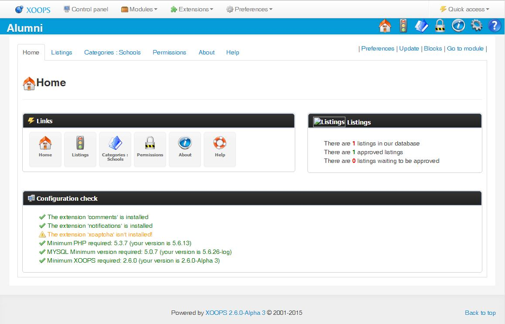

### _XOOPS Documentation Series_

# Module Alumni
#### for XOOPS 2.6.0
      

            
## User Manual

© 2016 XOOPS Project ([www.xoops.org](http://xoops.org))   

## Module Purpose 

This module is  to list the Alumni of your school or a group of schools. You can upload 2 photos: one graduation photo and one recent photo.

*Figure 1: Main view of the Alumni Module (Admin side)*

## Download/Fork the Module  

**You can fork the module --> [here](https://github.com/XoopsModules25x/alumni))** 

## How to Contribute

[You can contribute on GitHub](https://github.com/XoopsDocs/alumni-tutorial). Changes will be [pushed to Gitbook.io automatically](https://www.gitbook.com/book/xoops/alumni-tutorial/activity) when the [main repository](https://github.com/XoopsDocs/alumni-tutorial) changes.

Editing the book can be done either by updating the markdown files with a text editor, or opening the repository in [the Gitbook desktop app](https://github.com/GitbookIO/editor/blob/master/README.md). The desktop app will give you a live preview option.

# Table of Content

* [Install/Uninstall](book/1install.md)
* [Administration Menu](book/2administration.md)
* [Preferences](book/3preferences.md)
* [Operating Instructions](book/4operations.md)
* [The User Side](book/5userside.md)
* [Blocks](book/6blocks.md)
* [Templates](book/7templates.md)
* [Miscellaneous](book/8other.md) 
* [Module Credits](book/9credits.md)
* [About XOOPS CMS](book/10aboutxoops.md)

##License:

<a rel="license" href="http://creativecommons.org/licenses/by-nc-sa/4.0/"> Unless specified, this content is licensed under a <a rel="license" href="http://creativecommons.org/licenses/by-nc-sa/4.0/">Creative Commons Attribution-NonCommercial-ShareAlike 4.0 International License</a>.

All derivative works are to be attributed to XOOPS Project ([www.xoops.org](http://xoops.org))
